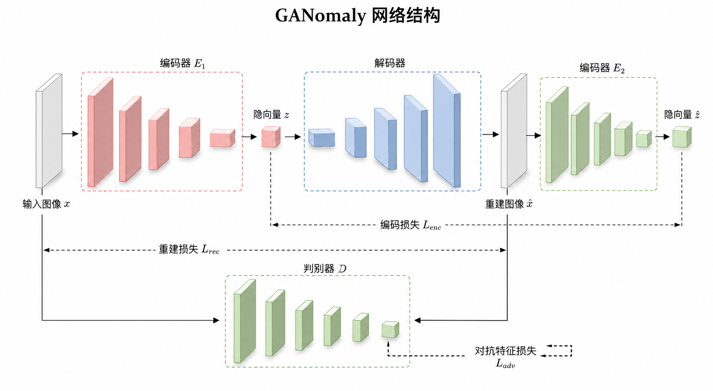
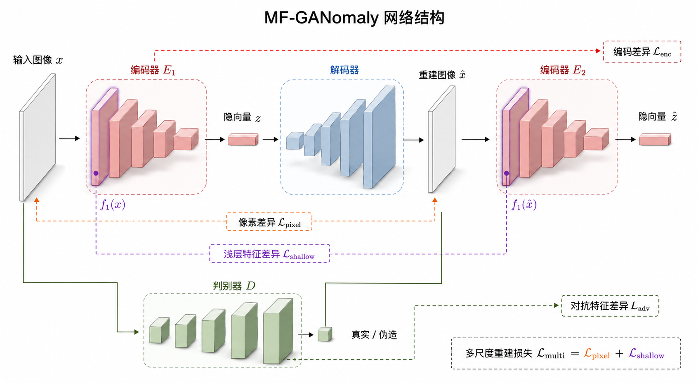
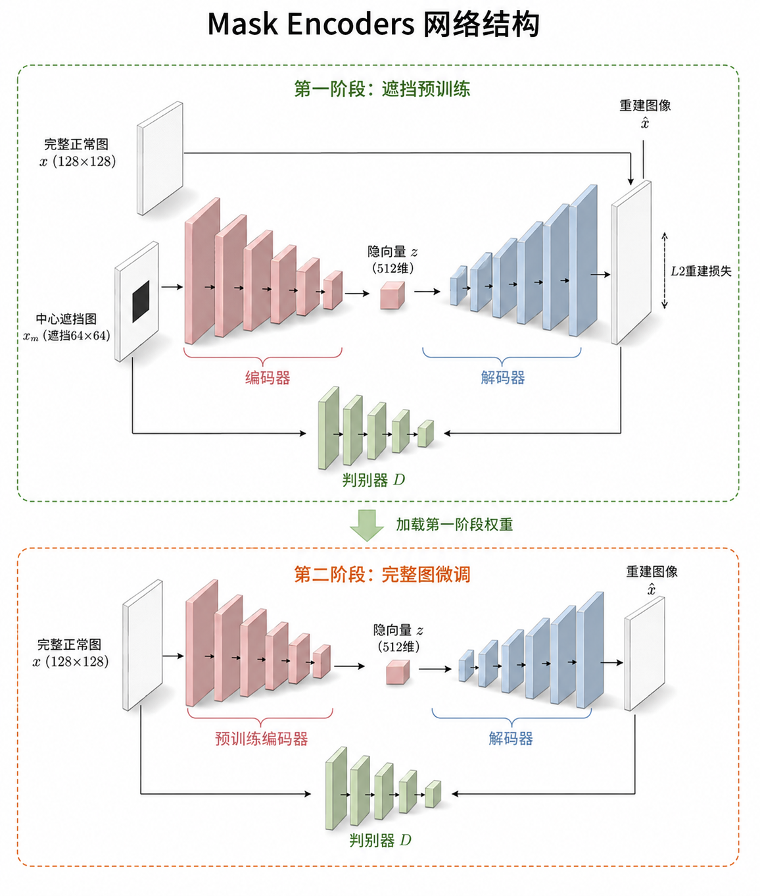
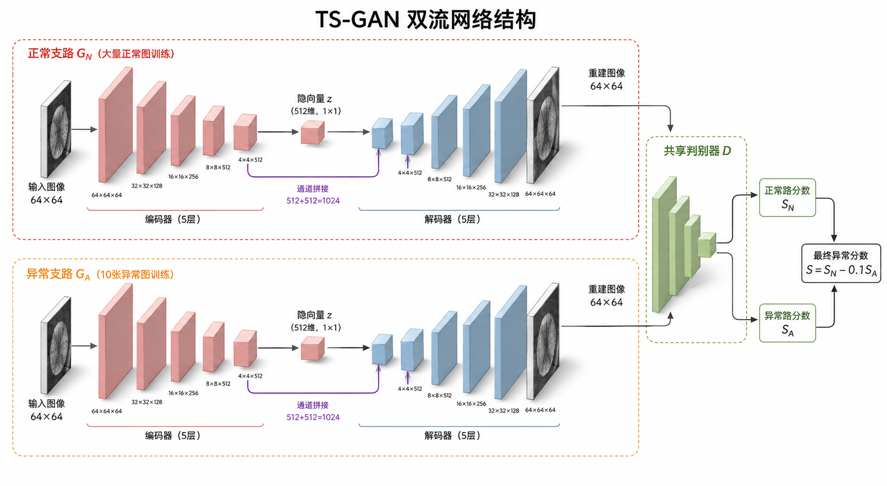

# PyTorch 图像异常检测复现

本项目用于逐步复现步兆军硕士论文《基于自监督与弱监督学习的图像异常检测研究》，目前聚焦 MVTec AD `grid` 类别。

## 当前进度

- [x] GANomaly：训练、测试与固定四块裁剪实验已完成。
- [x] MF-GANomaly：实现、训练与测试已完成。
- [x] Mask Encoders：两阶段实现、训练与测试已完成。
- [x] TS-GAN：实现、训练与测试已完成。
- [x] TS-GAN 像素级热力图与 Pixel-level AUROC 代码已完成。
- [ ] 其余三个模型的像素定位、多随机种子复验和消融实验。

## 当前实验结果

| 模型 | 四块最大值 Image AUROC | 四块平均值 Image AUROC | 论文报告值 | 状态 |
|---|---:|---:|---:|---|
| GANomaly | 0.6817 | **0.7026** | 0.658 | 已训练、已测试 |
| MF-GANomaly | **0.7703** | 0.7510 | 0.740 | 已训练、已测试 |
| Mask Encoders | **0.9365** | 0.9056 | 0.785 | 已训练、已测试 |
| TS-GAN | **0.9534** | 0.9240 | 0.806 | 已训练、已测试 |

Mask Encoders 本次测试的 patch 平均 PSNR 为 `24.2551`，SSIM 为 `0.7862`。论文对应报告值为 PSNR `23.631`、SSIM `0.802`。TS-GAN 使用 10 张异常图片进行弱监督训练，测试时排除了这 10 张图片，因此其测试集为 68 张，不能与其他模型的 78 张测试集直接作严格横向比较。

最大值和平均值是两套不同的图片级评分规则，表中同时保留，未根据测试集结果事后选择。当前结果仅来自随机种子 42，且论文部分实现细节未完全公开，因此不能把数值差异直接视为模型优劣。

完整的实验设置、结果解读和复现限制见：[四个模型复现结果总结](reports/final_results.md)。

## 四个模型的结构示意图

这些图片用于直观理解数据流；严格的层数、张量形状和损失公式请以代码及各模型说明文档为准。

### 1. GANomaly

正常图像经过“编码器 → 解码器 → 再编码器”。训练时同时使用重建损失、编码损失和判别器特征损失。



### 2. MF-GANomaly

在 GANomaly 基础上加入浅层特征重建误差，让模型同时关注整体结构和较细小的纹理差异。



### 3. Mask Encoders

第一阶段用遮挡后的正常图学习补全，第二阶段再用完整正常图微调，使模型更依赖正常纹理规律，而不是仅复制输入。



### 4. TS-GAN

正常支路和异常支路各有一套独立生成器，并共享同一个判别器；最终结合两条支路的分数判断异常。



## 环境安装

建议使用 Python 3.11 和支持 CUDA 的 PyTorch。先根据显卡和驱动从 PyTorch 官方源安装 `torch` 与 `torchvision`，再安装其余依赖：

```powershell
python -m pip install -r requirements.txt
python -m pip install -e .
```

本次开发环境使用 PyTorch 2.11.0+cu128。论文环境为 PyTorch 1.8.0、CUDA 11.4，两者存在版本差异。

## 数据准备

本仓库不上传 MVTec AD 数据集。预期目录：

```text
<DATA_ROOT>/grid/
  train/good/
  test/good/
  test/bent/
  test/broken/
  test/glue/
  test/metal_contamination/
  test/thread/
  ground_truth/<defect_type>/
```

修改 `configs/*.yaml` 中的 `dataset.root`，使它指向本机数据目录，例如 `E:/datasets/mvtec_ad`。

## 训练与测试

所有命令均在项目根目录运行。也可以在 PyCharm 中直接运行对应的 `train_*.py` 或 `evaluate_*.py`。

### GANomaly

```powershell
python -m anomaly_reproduction.train_four_crops
python -m anomaly_reproduction.evaluate --checkpoint runs/ganomaly_grid_four_crops_seed42/checkpoint_final.pt
```

### MF-GANomaly

```powershell
python -m anomaly_reproduction.train_mf
python -m anomaly_reproduction.evaluate_mf
```

详细说明：[MF-GANomaly 运行说明](reports/mf_ganomaly_guide.md)

### Mask Encoders

```powershell
python -m anomaly_reproduction.train_mask
python -m anomaly_reproduction.evaluate_mask
```

详细说明：[Mask Encoders 运行说明](reports/mask_encoders_guide.md)

### TS-GAN

```powershell
python -m anomaly_reproduction.train_ts
python -m anomaly_reproduction.evaluate_ts
python -m anomaly_reproduction.localize_ts
```

详细说明：[TS-GAN 运行说明](reports/ts_gan_guide.md)

`localize_ts` 不重新训练模型。它读取异常阶段最终检查点，排除异常支路见过的
10 张训练图片，使用正常支路重建图，并按照论文描述计算“整体 PSNR 与滑动窗口
局部 PSNR 的差值”，最后将四个裁剪块重新拼接。论文没有公开窗口大小、步长和
重叠窗口汇总方式；当前明确采用窗口 8、步长 1、重叠响应逐像素取平均，可以通过
`--window-size` 和 `--stride` 调整。结果会在
`runs/ts_gan_grid_seed42/stage2_abnormal/pixel_localization_checkpoint_final/`
保存真值掩码、原图、正常支路重建图、连续 PSNR 热力图及叠加图。
论文没有设置像素二值化阈值，也没有报告 Pixel AUROC；项目额外计算 Pixel AUROC
只用于分析，不将其冒充为论文结果。

### AITEX 跨数据集直接验证

`evaluate_aitex_ts` 直接加载在 MVTec AD Grid 上训练完成的 TS-GAN，不使用
AITEX 重新训练。AITEX 长条图先切成 256×256 正方形图块，再缩放为模型需要的
64×64；每种织物固定取 5 张正常图作为无异常阈值校准集，其余正常图和全部缺陷图
才参与正式评价，避免使用测试异常标签选择阈值。

```bash
PYTHONPATH=src python3 -m anomaly_reproduction.evaluate_aitex_ts \
  --data-root /workspace/datasets/aitex/extracted
```

结果保存在 `runs/ts_gan_grid_seed42/stage2_abnormal/external_aitex/`，包括图块分数、
整图分数，以及最大值/平均值聚合下的 AUROC、AP、准确率、精确率、召回率和 F1。

## 目录说明

```text
configs/       每个模型的实验参数
data/          数据说明（不包含原始数据集）
src/           数据读取、模型、损失、训练与评估代码
tests/         已有的小型自动检查
runs/          四个正式实验、归档实验、缓存、日志和模型权重（不会上传 GitHub）
reports/       结构图、模型说明与复现实验记录
```

## 后续 TODO

- [ ] 检查 TS-GAN 共享判别器的训练曲线与饱和情况。
- [ ] 对四个模型统一测试协议，补充异常热力图和 Pixel-level AUROC。
- [ ] 使用至少 3 个随机种子重复实验，报告均值与标准差。
- [ ] 完成四块最大值/平均值聚合方式的消融实验。
- [ ] 核对论文未明确公开的实现细节，记录所有复现假设。
- [ ] 汇总四个模型的速度、显存占用和定量结果。

## 复现原则

- 每次只改变一个因素，并保存配置和随机种子。
- 不挑选最好的一次结果；所有评分协议都明确命名。
- 论文没有写清楚的细节标记为“复现假设”。
- 数据集、虚拟环境、`runs/` 和模型权重由 `.gitignore` 排除，不上传 GitHub。

本项目用于学习和科研复现，不代表工业生产结论。
